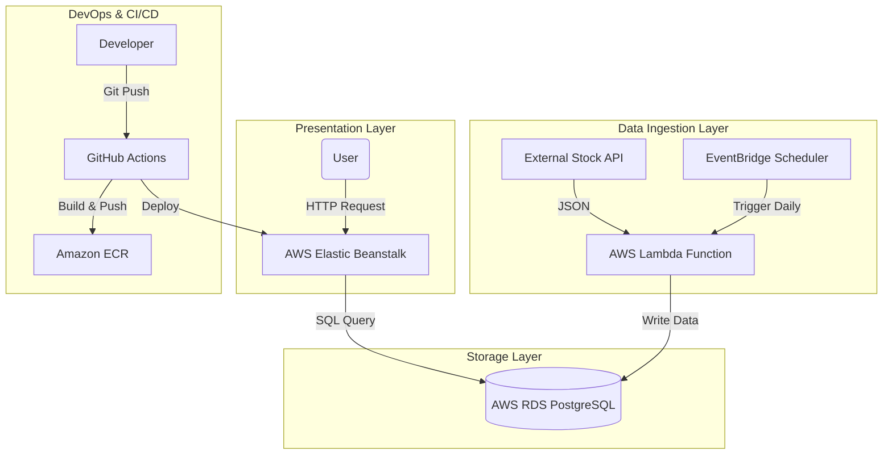

# 🚀 US Tech Stock Data Pipeline & Portfolio

## 📊 Live Demo
👉 **View the Live Dashboard:** [http://tarig-portfolio.us-east-1.elasticbeanstalk.com/](http://tarig-portfolio.us-east-1.elasticbeanstalk.com/)

---

## 💡 Project Overview
This project is a full-stack **Data Engineering** solution that automates the extraction, transformation, and loading (ETL) of US Tech stock market data.

It features a **Cloud-Native Architecture** where data is fetched daily via serverless functions, stored in a relational database, and visualized on a dynamic dashboard hosted on AWS. The entire application is containerized and deployed via a fully automated CI/CD pipeline.

### 🌟 Key Features
* **Automated ETL:** Daily scheduled extraction of stock data (TSLA, AAPL, NVDA) using **AWS Lambda** & **EventBridge**.
* **Cloud Storage:** Persistent data storage in **AWS RDS (PostgreSQL)**.
* **Visualization:** Interactive dashboard built with **Streamlit** & **Plotly**.
* **Containerization:** Application runs in a **Docker** container for consistent environments.
* **CI/CD Pipeline:** Automated build, test, and deploy workflow using **GitHub Actions**, **AWS ECR**, and **Elastic Beanstalk**.

---

## 🏗️ Architecture

Domain             Tools Used
Cloud Provider     AWS (US-East-1)
Compute            "AWS Lambda (Serverless), Elastic Beanstalk (PaaS)"
Storage            "AWS RDS (PostgreSQL), Secrets Manager"
Orchestration      AWS EventBridge (Scheduler)
Containerization   "Docker, Amazon ECR"
CI/CD              GitHub Actions
Visualization      "Streamlit, Plotly"

🚀 How to Run Locally

1. Clone the Repository
   git clone [https://github.com/tarigelamin1997/tadawul-data-pipeline.git](https://github.com/tarigelamin1997/tadawul-data-pipeline.git)
   
   cd tadawul-data-pipeline

3. Set up Environment Variables Create a .env file in the root directory:
   DB_HOST=your_db_host
   DB_NAME=your_db_name
   DB_USER=your_db_user
   DB_PASS=your_db_password
   
4. Run with Docker
   docker build -t stock-portfolio .
   docker run -p 8501:8501 --env-file .env stock-portfolio

5. Access the App Open your browser and go to http://localhost:8501

🔄 CI/CD Workflow
The project implements a continuous deployment pipeline:

Source Control: Code is pushed to the main branch.

GitHub Actions:

Authenticates with AWS.

Builds the Docker image.

Pushes the image to Amazon ECR.

Updates the Elastic Beanstalk environment with the new version.

👨‍💻 Author
Tarig Elamin Data Engineer | Cloud Specialist LinkedIn Profile: www.linkedin.com/in/tarigelamin
